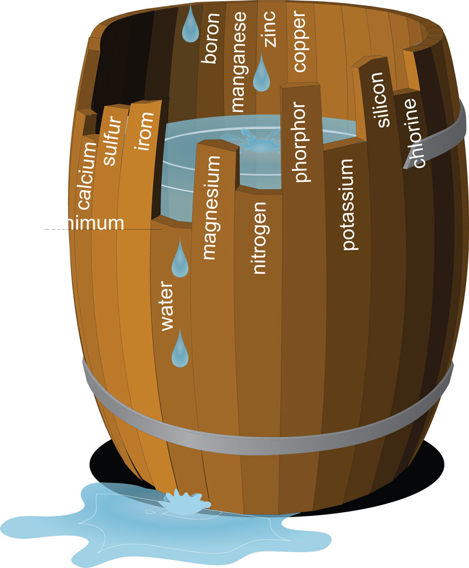
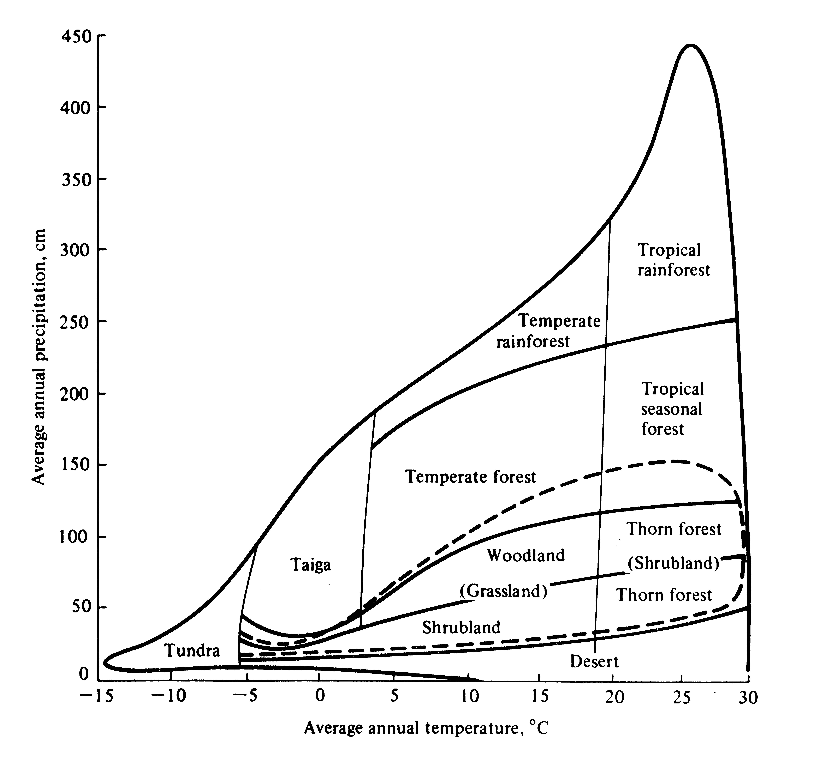

```{r setup, include=FALSE}
library(tufte)
# invalidate cache when the tufte version changes
knitr::opts_chunk$set(tidy = FALSE, 
                      message = FALSE, 
                      warning = FALSE,
                      echo = FALSE,
                      cache.extra = packageVersion('tufte'))
options(htmltools.dir.version = FALSE)
```

```{r, include=FALSE}
library(tidyverse)
library(scales) # for prettier axis labels
# library(simecol) # for running model 
theme_set(theme_minimal())
```

We have introduced the idea that we can think of life as a series (or symphony) of interlocking chemical reactions, which means that what we have learned about chemistry can teach us a few things about ecology. Let me first review the reactants side of things.

# Rates are controlled by the most-limiting reagent

One way to speed a chemical reaction is to increase the concentration of the reactants. This is also true, to an extent, in biochemical reactions. Or more to the point, if a reactant is missing, it slows the rate of the reaction^[A plant cannot fix CO~2~ with photosynthesis if there is no more CO~2~!]. But what is important to remember about biochemical reactions is that reactions are chained together such that the product of one is the reactant of another. So slowing down one reaction can slow down others^[If nitrogen is limiting, it slows down production of amino acids, which slows down protein synthesis, which slows down growth or repair of myriad cell structures, and so on.]. 

```{r, fig.margin = TRUE}

```

What is important to remember is the rate of a reaction is limited by the reactant that is in the most limited supply. What this means is that if nitrogen is limiting, adding more phosphorus is unlikely to speed up the reaction(s). But it also means that adding nitrogen speeds up the reaction only until something else becomes limiting. This is often called Liebig's law of the minimum^[A prime example of [Stigler's law of eponymy](https://en.wikipedia.org/wiki/Stigler%27s_law_of_eponymy).] or Liebig's barrel, because, like the water level in a barrel is limited by the shortest stave, the growth of a plant or animal is limited by the nutrient in shortest supply. Me, I like to think about this as the law of the movie theater popcorn. Sure, a small popcorn is lovely and a medium increases my happiness, but I never get the super large size, even if it is just 50 cents more, because I know my happiness is no longer limited by popcorn, but probably by my need for water given all the salty popcorn I just ate!
In any case, given this insight is it any surprise that one line of defense against invading pathogenic bacteria is for our bodies to sequester nutrients that likely limit bacterial growth?

## An organism's stoichiometry can help explain where and when it flourishes 
If we follow Liebig's law of the minimum a short step further, we might note that fertilizers, for instance, might be most effective if they included several of the commonly limiting nutrients. And they might be more effective still if they contained the right _ratios_ of these limiting nutrients. Why is this? Well in a word, stoichiometry.  In more words, chemical reactions use nutrients in particular ratios. For instance, photosynthesis takes six CO~2~ molecules and 12 H~2~O molecules, plus some light and fancy enzymes, to make one sugar (C~6~H~2~)~6~) and some oxygen and water. That is more O's than C's in this particular reaction. Similarly, while amino acids require nitrogen, they have a lot more carbon and oxygen atoms in them. 

More broadly, we can think about _ecological_ stoichiometry, where we consider what the whole organism needs and uses, as opposed to particular chemical reactions. We need nitrogen not just for amino acids, but also RNA and DNA. We need phosphorus in our nucleic acids, but also phospholipids, and ATP, along with structural elements in bones. We can sort of set aside the issue of where the N's and P's go and just think about how many N's a body needs relative to the P's, and if we get this ratio right we tend to maximize the rates of the organism's chemical reactions. 

This ecological stoichiometry is a relatively new idea and undertaking, and it is not entirely clear how far we can run with it, but there are some very interesting places where it clearly works. For instance, rapid growth requires the production of a lot of nucleic acids, ATPs, and ribosomes, which require a lot of phosphorus. Thus, we find, at least in some settings like zooplankton, that fast-growing species and life stages tend to grow best with more P than N (or, equivalently, lower N:P ratios) than slower-growing species and stages. Indeed, lab experiments demonstrated that one could manipulate the relative dominance of copepods (cylopoid crustations) versus _Daphnia_ (cladocerans) by changing the elemental ratios in the food they were provided. The ideas have been promoted in all sorts of areas (e.g., cancer research), but again, it is not always clear that what is true at the small scale is necessarily important at the large.

Now, the new stuff!

# Rates are controlled by conditions, too

We have so far spent most of our thoughts on the _reactants_ of a chemical reaction, but the _conditions_ of the chemical reaction also matter a great deal. If you spend much time in a chemistry lab, you will realize that the conditions---from the cleanliness of the reaction vessel to the presence or absence of, say, oxygen to the temperature or pressure at which things are done---matter tremendously. The same is true for biochemical reactions that make up life. Let's start with the most obvious condition: temperature.

## Heat helps reactions along

If I were to ask you how to increase the rate of a reaction, the two most common (and perhaps important) answers would be: 1) increase the concentration of the reactions (as we have mentioned a few times today) and 2) increase the temperature. Temperature provides energy that can make otherwise impossible reactions possible, slow reactions fast. This translates in a very real way to the observation that cold lizards are slow lizards while hot ones are fast. Or the fact that mosquitoes cannot function in the cold. Temperature, as we will learn, is a crucial factor for most of life. It affects population growth rates^[Think of bacteria or fungal pathogens growing in a temperature-dependent fashion.], distributional ranges, physiological responses including immune responses, and the outcomes of interactions. More on all of this later.

## Water is key, too

When we think of chemical reactions, we usually think of them happening in solution, so the water is just a given. But of course without water, many chemical reactions do _not_ work, and even if water is limiting the increase concentrations of chemicals in solution can cause problems. These issues are worse by 10 in living cells. Because cells are not simply test tubes or beakers; they are semi-permeable sacks made up of phospholipids and proteins. Stuff _leaks_ in and out! Things that should be in that sack over there get into this one here. Concentrations of things get all out of proportion. But even worse, cells can lose their structural integrity when there is not enough water or they are in a hyper-osmotic solution, where the water inside diffuses to the outside. Or they can explode if in a hypo-osmotic solution. So too much or too little water can be problematic^[Ignoring the myriad of physiological and structural mechanisms to maintain water balance]. 

For plants, water is of course essential for nutrient transport from roots to shoots. But it is also important in photosynthesis for several reasons. Among the most consequential is that when plants open their stomata to let in \ce{CO2}, they inadvertently let out water. So in the process of making their photosynthetic reaction more efficient, by increasing the concentration of \ce{CO2}, they lose water. This trade-off is so important that it has led to the evolution, many times, of a more water-efficient form of photosynthesis called C4, as opposed to the normal C3, and even, in especially water restrictive environments, extra machinery called CAM photosynthesis^[My hope is that by continuing to mention it, you'll eventually ask to know more about these different types of photosynthesis]. 


```{r, fig.margin = TRUE, fig.cap="A Whittaker biome diagram. Notice what's on the axes that organize the biomes?"}

```

Moreover, if you tell me the temperature and precipitation in a place, I can probably tell you what sorts of plants grow there, and thus what it looks like, what the animals might be like, and so on. These two variables---temperature and moisture---are hugely important for all organisms, but especially plants. 


## What about \ce{O2}?

There are many other important conditions that govern the rates of chemical reactions, and thus life, but the third major one is oxygen concentrations. This is tricky, to a degree, because it is also a nutrient of sorts for most life^[Remember CHNOPS?]. However, for some organisms \ce{O2} is not a resource that is used, but rather a nuisance that keeps their chemical reactions, including those involved in metabolism, from working right. Many specialized bacteria work best under anoxic conditions---when free \ce{O2} is not available, but chemically bound oxygen, such as in \ce{NO3-}. For instance, the denitrification process occurs when free oxygen is not available and so denitrifying bacteria use the oxygen in \ce{NO2-} and \ce{NO3-} for electron acceptors. In these and many other cases, oxygen is essentially toxic to the anaerobic or fermenting microbes^[Anoxic refers to the conditions; anaerobic to the metabolic processes used.]. Other times, the rates of reactions, including the nitrogen fixation process, are governed by oxygen concentrations. 

And of course, from the flip side, aerobic organisms such as ourselves do poorly when oxygen concentrations drop. But wait! In our case, the \ce{O2} is a reactant, or more broadly a resource. What is the difference?

# Resources vs. conditions

This last example led to a tricky situation where sometimes oxygen was  considered a resource and sometimes it was treated as a condition. So what is the distinction? 

Let me give you a few things to categorize as either resource or condition (or both!). I think you won't have too much trouble with it. But then think about what characterizes one list vs. the other. 

* pH
* Nitrogen
* Phosphorus
* Sunlight
* Water
* Oxygen
* Salinity
* Shade
* Hole or crevice
* Soil type (e.g., sand, clay, etc.)
* Fire (risk or frequency)
* Waves or tides
* Humidity
* Temperature


**Resources**      \hspace{7cm} **Conditions**
