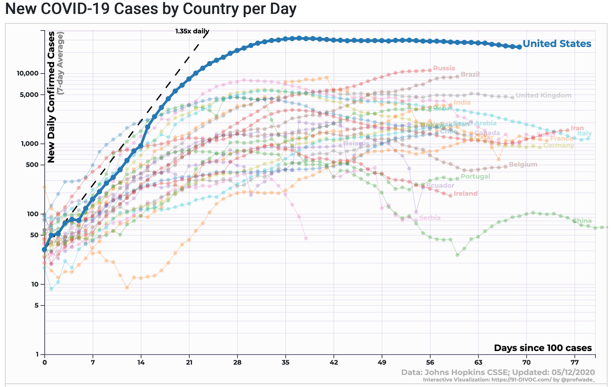

```{r setup, include=FALSE}
library(tufte)
# invalidate cache when the tufte version changes
knitr::opts_chunk$set(tidy = FALSE, 
                      message = FALSE, 
                      warning = FALSE,
                      echo = FALSE,
                      cache.extra = packageVersion('tufte'))
options(htmltools.dir.version = FALSE)
```

```{r, include=FALSE}
library(tidyverse)
library(gmp) # for large numbers to display correctly
library(scales) # for prettier axis labels
theme_set(theme_minimal())
```

# The power of doubling

Some years ago I had the opportunity to teach about ecology and evolution in a master gardener program. I was thrilled and started thinking about all of the things I thought would be fun and useful to teach about. Then I learned that I had one evening, something like 2 or 3 hours. How on earth could I fit this all in? What was essential? Then, after some thought, I realized that if I could convey the power of exponential growth, and a bit about heritable variation, the rest followed. All these years later I still think that if I could convey one lesson it would be this: beware the awesome power of exponential growth.

In that first class with master gardeners, and in many classes with undergraduate and graduate students since, we explored the classic lesson about doubling^[And yes, doubling and exponential growth are intimately linked] on a chess board. The almost certainly apocryphal story goes something like this: The king/emperor/bigwig was so thrilled with the new game of chess that he reward its inventor with anything he might desire. The clever game-maker offered the modest suggestion that he receive a single grain of rice^[Or wheat, depending on the version.] on the first square, two on the second square, four on the third and so on and so forth. In the end this amounted to more grain or rice than existed in the kingdom and so, depending on the version, the inventor is either made an adviser (or king in the version I was told) or executed^[https://en.wikipedia.org/wiki/Wheat_and_chessboard_problem]. Nice story and all, but without some numbers it lacks a certain oomph. So, how much rice or wheat is that?

```{r}
chess <- data.frame(Square = 1:10)
chess <- chess %>% 
  mutate(Rice = 2^(Square-1),
         Total = cumsum(Rice)
  )
knitr::kable(chess,col.names = c("Square ($x$)", "Rice on square $x$ ($n$)", "Total rice by square $x$ ($T$)"))
```


Before we look at The Big Numbers that I've hinted at, let's see if we can't spot a pattern in how they grow (see the table above for the first ten squares).  Perhaps you'll recognize that the numbers on the squares are powers of two.

\begin{align}
2^0 &= 1\\
2^1 &= 2\\
2^2 &= 4\\
2^3 &= 8
\end{align}

Following this pattern the amount on the 5th square is $2^{5-1}= 2^4 = 16$ and the amount on the 64th square is $2^{(64-1)} = 2^{63}$. In general^[Note that if we started counting the first square as zero, as we would if we were tracking time instead of counting squares, this would simply be $n(x)=2^{x}$.] for square $x$, the number of grains on the square is: 
$$
n(x)=2^{x-1}.
$$

What about the _total_ number of grains on square $x$, which we'll call $T(x)$? We could just do the math and add those numbers up: $T(x)=2^0 + 2^1 + 2^2 + \dots + 2^{x-1}$. We could also write it more compactly using the summation sign, $\Sigma$: $T(x) = \sum_{i=1}^{i=n} 2^{i-1}$. But we can also cheat a bit if we notice the pattern. The total in the first two squares is $1+2=3$ and in the first three squares is $1+2+4=7$ and in the first four squares is $1+2+4+8=15$. These sums are _close_ to the power of two (i.e., $2^2, 2^3, \text{ and}, 2^4$). Indeed, in each case they are just one below that power. The pattern is $T(x) = 2^x - 1$. So the total (cumulative) number of grains on the 64 squares^[If we started counting with $x=0$ then this would be $T(x) = 2^{x+1} - 1$.] of the chessboard given this little doubling game is $T_{64}=2^{64}-1$.

Now, how much are those? 

$n_{64}=2^{64-1}=2^{63}$ = `r prettyNum(as.bigz(2^63), big.mark = " ")`

$T_{64}=2^{64}-1=$ \hspace{0.4cm} `r prettyNum(as.bigz(2^64-1), big.mark = " ")`

Those are big numbers! Quintillions or, if you prefer, billions of billions! But quite honestly that doesn't mean a lot to me. I tried [Wolfram Alpha](https://www.wolframalpha.com/input/?i=2^64+grains+of+rice) and while the nutrition label wasn't terribly helpful, it is sort of fun!
```{r, fig.cap="Nutritional value of a huge amount of rice.", fig.margin=TRUE}
knitr::include_graphics('Rice_Nutrition.png', dpi = 500)
```

Let's try again. What is the total rice production in the world? [Wolfram Alpha](https://www.wolframalpha.com/input/?i=2^64+grains+of+rice) places it at 2.573 billion metric tons per year or $2.573 \times 10^9 \text{tons} \times 1000 \text{kg/ton} = 2.573 \times 10^{12} \text{kg}$. That's a lot! But it still pales in comparison to the $9.2 \times 10^{14} \text{kg}$ that the chessboard rice is estimated to weigh (see the nutrition panel above). In other words, we produce several _hundred_ times less rice in a year than would have been on that chess board if the king or emperor had been able to follow through on the deal. Zowie!

I am by no means the first to use this example or to try to provide some context to the numbers^[Just search online for "exponential growth chess board" and you'll find TED talks, YouTube videos, and even stock photos. One of my favorites is this one: https://makershare.com/projects/chess-board-rice-exponential-growth]. The numbers are pretty mind boggling and so many have tried to put them in perspective. But it is important to note that doubling processes, and exponential growth more broadly, is interesting not just because you can get really, really huge numbers, but because of how you get there^[For instance, by the 13th square you would have enough rice for one bowl of rice, but by square 24 you would have enough rice to make the worlds largest paella (2400 bowls of rice)! Do with this information what you will.]. 


# Doubling processes can sneak up you

A classic question in math and ecology exams is the following: If a lily pad population grows so that it doubles its size (or coverage of a pond) each day and it covers the whole pond on the 20th day, on what day was the pond half covered? Take a moment and think about it...

The answer is to work backwards. If the lily pad population doubles each day, then moving backward in time it is halved each day. So they covered half the pond the day before they covered the whole thing; the answer is day 19. The same is true for our chess board example and any other doubling process, although it may take more or less time than a day to double. For instance, if we were watching these lily pads grow on a pond, how much time would we have from when they covered $< 1\%$ of the pond to it covering the whole thing? 

Well, on day 19 they covered half the pond, on day 18 they covered one-quarter of the pond (half of a half), on day 17 they covered one-eighth the pond (half of a half of a half), and so on. If $x$ is the time _before_ some threshold (i.e., 100% coverage occurs at $x=0$), such that $x$ is $0,-1,-2,...$, then the fraction of the pond covered at time $x$ is $n(x) = 2^x$. We find that when $x=-7$ less than $1\%$ of the surface area would be covered (precisely, $2^{-7} = 0.0078125$ or 0.78%). Think about that. If you were watching the lily grow, you wouldn't see anything worrying for a long time. Only on day 14 would more than 1% of the surface area be covered. Why worry? But in just a few days, a few more rounds of doubling, this process would start to look rather out of control. 

The fact that doubling processes only seem out of control later on has been called the "second half of the chessboard" in business^[https://en.wikipedia.org/wiki/Wheat_and_chessboard_problem], but it applies equally to many processes. For instance, biological invasions start with small numbers of individuals that are quite capable of doubling over some time interval and are often discovered too late, as the invasion is out of control. The same is true of epidemics. They start small, but if one person infects two others, it is only nine "generations" of infection before that one infected person becomes more than a thousand, and nineteen generations before there are more than a million! 

It can be hard to recognize how a doubling process might grow in the early days. Again, the initial numbers are small and seemingly innocuous, if not plain hard to detect^[Consider the discovery of the (Asian giant hornet)[https://www.nytimes.com/2020/05/02/us/asian-giant-hornet-washington.html] in the Pacific Northwest. Was it _just_ introduced? Were there multiple introductions? Will it grow exponentially?]. But also, most processes, at least biological processes are messy or stochastic. One infected person give rise to one new infection, or three, or none. Those chance outcomes have a lot of influence early on in the process when the numbers are low, but average out later, when there are more people doing the infecting, or more individuals of an invasive species reproducing. 

```{r, fig.margin=TRUE, fig.cap="The doubling process with increasing amounts of chance or noise in the process. Each process was run three time. Notice that one of the three processes with the most noise fizzled out after generation three."}
myreds <- c('black', RColorBrewer::brewer.pal(4,"Reds")[c(3,4)])

doubling <- function(x, sd) {
  round(x*rnorm(length(x), mean=2, sd=sqrt(sd)/sqrt(x)))
  }

set.seed(5)

df <- expand.grid(Time=1:5, 
            Rep=LETTERS[1:3], 
            SD=c(0, 0.1, 1))

for(i in 1:nrow(df)){
  if(df$Time[i]==1) {
    df$N[i] <- 1
  } else {
    df$N[i] <- doubling(x=df$N[i-1], sd=df$SD[i])
  }
}


df <- df %>%
  group_by(SD, Rep) %>% 
  mutate(N = cumsum(N))


ggplot(df, aes(Time, N, color=as.character(SD), group=paste(Rep,SD))) + 
  geom_line(alpha=2/3) +
  geom_point(size=1/2) + 
  scale_x_continuous("Time (\"generations\")", breaks = 1:6,
                 minor_breaks=0:10) + 
  scale_y_continuous("Cumulative number") + 
  scale_color_manual("\"Noise\"",
                     values=myreds) 
```


Given the noisiness due to randomness in real-world processes, it is often hard to know if something is growing rapidly or slowly, or even whether it might be exponential at all. Figuring it out is important, though, as early interventions are critical (see below). 


## Exponential growth more broadly

So far we have been dealing with processes where something doubles every time step. This is simply a special case of geometric growth (or decay), which is really just a discrete version of exponential growth (or decay). What does this mean? Let us first focus on the discrete cases.

There are many cases where growth happens in discrete steps. For instance, birds and amphibians in temperate habitats usually breed in the spring and so there is a pulse of reproduction^[Although mortality can happen all year long.]. Similarly, your bank account might apply interest (or fees!) once a month. We might write an equation for the amount $n$ at time $t$ as, 
$$
N(t) = N_0 \times \lambda^t,
$$
where $N_0$ is what you started with and $\lambda$ is the per time-step growth rate. If $\lambda = 1$ the amount never changes, but if $\lambda > 1$ the amount increases. And of course if $\lambda < 1$ then the amount decreases. 

Now you might wonder how this equation relates to our chess-doubling game above, where $n(x)=2^{x-1}$. They are actually identical if we set $t=x-1$, because above we started counting at square one instead of time zero, $N_0 = 1$ because there was one grain of rice on the first square, and $\lambda = 2$ because we doubled every step. What this version of the equation makes clear is that we could play many versions of the game where instead of doubling  each step ($\lambda = 2$), we triple ($\lambda = 3$) or increase by one-quarter ($\lambda = 1.25$) or shrink by half ($\lambda = 0.5$) or use any other rate of change. It is also important to note that even if we are not precisely doubling each step ($\lambda \neq 2$), so long as the amount grows, it will double, and then double again, and so on. 

We can find the doubling time, which I will call $\tau$, given any (positive) value of $\lambda$ by recognizing that $N(\tau) = 2N_0$, taking the log of both sides, and then doing some re-arranging.

\begin{align}
N(\tau) = 2N_0 &= N_0 \times \lambda^\tau\\
2&=\lambda^\tau\\
\log(2) &= \log( \lambda^\tau ) = \tau \times \log(\lambda) \\
\tau &= \frac{\log(2)}{\log(\lambda)}
\end{align}

So if $\lambda=2$ then the doubling time $\tau=1$ and if $\lambda = 1.5$ then $\tau = \log(2)/\log(1.5) = 1.7095$. 


For many processes, from dividing bacteria to transmission of infections to the buying and selling of stocks, growth (or decline) does not happen in discrete steps, but rather everything happens all the time. In other words, it would be more accurate to think of time as continuous rather than discrete. 
```{r, fig.margin=TRUE, fig.cap='Geometric doubling (black line) occurs in discrete steps whereas exponential doubling (red line) is a continuous process.'}
ggplot(chess, aes(Square-1, Rice)) + 
  geom_step() +
  stat_function(fun=function(x)exp(log(2)*x), color="red") +
  scale_x_continuous("Time (t)", breaks = 2*0:5) +
  scale_y_continuous("N(t)") 
```
The same logic applies, but the equation looks slightly different:
$$
N(t) = N_0 \times e^{rt}.
$$
In this exponential equation $e^r$ is equivalent to $\lambda$ in the geometric equation; we just need to keep in mind in this version the amount does not change when $r=0$ because $e^0 = 1$, it grows when $r>0$ and it shrinks when $r < 0$. Moreover, the doubling time is simply, 

\begin{align}
\tau &= \frac{\log(2)}{\log(\lambda)} \\
&= \frac{\log(2)}{\log(e^r)} \\
&= \frac{\log(2)}{r}.
\end{align}
 
The doubling time is one when $r=\log(2) = 0.693$.

If you want to ignore the math, just note that these two equations are equivalent and produce equivalent dynamics; only one takes time (or chess squares) in discrete steps and the other treats it as continuous. Most mathematically-inclined people favor the exponential equation because it has nicer properties that make it easier to work with. 

# Exponential means a _constant_ growth rate

In our examples so far, some quantity (rice, lily pads, infections) doubles in every $\tau$ time steps or generation. This means that every individual (grain of rice, infected individual) yields two individuals in the next $\tau$ steps, always. It doesn't matter how many there are or what else is happening there is _always_ a doubling. This can be easier to see if we plot the data on a logarithmic scale. 

```{r, fig.margin=TRUE, fig.cap=c("The first ten squares of the chess board on a linear y-axis", "The first ten squares of the chess board on a log base 2 y-axis", "The first ten squares of the chess board on a log base 10 y-axis")}

P <- ggplot(chess, aes(Square,Rice)) + 
  geom_line() + geom_point() + 
  labs(x="Square on chess board, x", y="Grains of rice on square x") + 
  scale_x_continuous(breaks = chess$Square) 
P

P+ scale_y_continuous(breaks = chess$Rice, minor_breaks = NULL, 
                      trans = log2_trans()) 

P + scale_y_log10(breaks = 10^c(0:8))
```
What is important about a logarithmic scale is that there is a constant proportionality. On the second graph, with a log base 2 y-axis, the distance along the y axis between 2 and 4 is the same as between 16 and 32 or 512 and 1024; each represents a doubling of the number. On the third graph, with the more common log base 10 y-axis, the distance between 1 and 10 is the same as between 10 and 100; each represents a 10-fold increase. 

If a process produces a straight line on a logarithmic scale, it means growth (or decline) is happening at a constant rate. We can see why with a bit of light math. Let us simply take the log of both sides of the geometric growth equation and simplify.

\begin{align}
N(t) &= N_0 \times \lambda^t \\
\log(N(t)) &= \log(N_0 \times \lambda^t) \\
\log(N(t)) &= \log(N_0) +\log(\lambda)\times t
\end{align}

Notice that this now takes the form of a straight line ($y=b+mx$) where $\log(N_0)$ is the intercept and $\log(\lambda)$ is the slope. The rate of increase (or decrease, if the slope is negative) is $\log(\lambda)$ every where along the x-axis; it does not change. On the log-base 2 graph this doubling produces a slope of one because $\log_2(2)=1$. 

The math is even easier with the exponential equation,
\begin{align}
\log(N(t)) = \log(N_0 \times e^{rt}) \\
\log(N(t)) = \log(N_0) +r \times t
\end{align}
and shows that the slope on a (natural) log scale is simply $r$. Setting aside the math, what is the point? It is simply that logarithmic scales linearize geometric or exponentially growing (or shrinking) processes.

It is also important to note that slightly different slopes, representing different growth rates, can have dramatic effects on the resulting amounts. Even seemingly small changes in slopes (i.e., $r$ or $\lambda$) can have profound impacts on how large something grows, even over just 10 time steps (e.g., several thousand to several hundred thousand).

```{r, fig.margin=TRUE, fig.cap = c("Exponential growth with a range of intrinsic growth rates, $r$ on a linear scale.", "Exponential growth with a range of intrinsic growth rates, $r$ on a logarithmic scale.")}
exp2 <- function(x,r, n0=1){n0*exp(r*x)}

df2 <- expand.grid(x=seq(0,10, length.out = 101),
                   r=c(0.8,0.9,1,1.1,1.2))
df2 <- df2 %>% 
  mutate(y=exp2(x,r),
         r = factor(r))


Q <- ggplot(df2, aes(x=x, y=y, color=r)) + 
  geom_line() + 
  scale_x_continuous("Time (t)", breaks = 2*0:5) +
  scale_color_manual(values = c(muted("blue"), "blue", "gray", "red",  muted("red"))) 

Q + scale_y_continuous("N(t)", 
                      labels=comma
                     )
                
Q + scale_y_log10("N(t)", breaks = 10^c(1:9),
                      labels=comma
                     )
```


```{r, fig.cap="Number of new confirmed cases per day. From http://91-divoc.com/pages/covid-visualization/ on 13 MAY 2020. The slopes in this figure change for many reasons---social distancing, reduced contacts, local epidemics running their course---but what ever the reason, a shallower line means a slower rate of growth in new cases.", out.width="4in"}


```

This also transfers to changes in slopes along a line. When we look at cases of COVID-19 (or resulting deaths)---as I have been obsessively doing for many weeks---we are interested in the slope as cases go up, which indicates how rapidly the epidemic is growing. We are also looking (and hoping) for these lines to bend flatter and flatter, meaning first that the rate at which the epidemics are growing is slowing. Eventually we hope they will slope downward, meaning the epidemic is waning.  

# Early interventions are key

Imagine our apocryphal king got wise the doubling game and was able to renegotiate the terms of the game. Instead of doubling every step ($\lambda=2$), the amount increased by $\lambda=\sqrt[3]{2}=1.26$-fold every square so that the rice doubled every _three_ squares. How long would he have to recognize his mistake and change the game to have an impact? 

```{r, fig.cap="The number of grains of rice on each square given the original doubling game or when the rate was decreased at different points in the game."}
df3 <- expand.grid(Square=1:64,
                   Recognition=c(65,32,16,8,4))

df3 <- df3 %>% 
  mutate(Rice = 2^(Square-1))

for(i in 1:nrow(df3)){
  df3$Rice[i] = ifelse(df3$Square[i] <= df3$Recognition[i],
                       df3$Rice[i], 
                       df3$Rice[i-1]*2^(1/3))
}

R <- ggplot(df3, aes(Square, Rice, color=factor(Recognition))) + 
  geom_line() + 
  scale_x_continuous(breaks = c(1,8,16,24,32,40,48,56,64)) + 
  theme(legend.position = "none")

R + scale_y_log10("Rice on square x", 
                  breaks = 10^c(0,3,6,9,12,15,18), 
                  # this gives us the 10^x formatting of those labels
                  labels = trans_format("log10", math_format(10^.x)))
```
It turns out that _when_ the rules were changed and the pace of increase was changed is really critical. If the king changed the rules half-way through, after square 32, the amount of rice on the last square dropped from 9 quintillion---several hundred times the annual rice production in recent years---to a mere 3.5 trillion---less than 0.01\% of annual rice production. Thousands of thousands of times less rice! The payout would have gone from impossible to just quite expensive. And if the king changed the rules at square sixteen the amount of rice on the last square would be a mere couple billion grains, just 140 tonnes and easily accomplished. If he was very savvy and changed the rules after square 4, the last spot on the board would have had only 8 million or so grains of rice, just 544 kilograms, an amount on par with what is at your local grocery store. In other words, just changing the rate of doubling from every square to every third square, and doing it _early_ reduces an impossibly large problem to one that is easily managed. 

The same is true for any exponentially growing process, from invasive species to virus growing in a body to infections growing and spreading in a population. If you somehow change the game and reduce the rate of growth _early_, you have a much, much more managble problem on your hands.  Consider your immune response to a new virus infection. The first time around it takes days for your virus to recognize the threat and mount a sizeable immune response---B & T cells need to be activated, proliferate, create their effectors and so on. In the mean time the virus population is well on its way to enormous sizes, you get sick and feel rotten (hopefully not much more than that), and you likely spread the virus to someone new. Now the _second_ time you encounter this virus your immune system is ready. It has a head start and can start reducing virus population growth rates almost immediately. The virus is cleared out well before it reaches problematic levels. Vaccines work the same way; they give your immune system a head start so they can fight back early on, and that makes all the difference.

```{r, fig.cap="Actual and simulated numbers of COVID-19 deaths with earlier interventions. From www.nytimes.com/2020/05/20/us/coronavirus-distancing-deaths.html."}

knitr::include_graphics("Intervention_COVID.png", dpi=400)
```

Similar logic applies to a growing epidemic or the invasion of an exotic species. Early interventions can keep exponentially growing problems smaller and more manageable. This is clear with COVID-19 epidemics. In nations and regions that adopted interventions like social distancing and restricting the size of public gathers kept those epidemics from getting as large as the places that waited^[Yes, there are exceptions to the pattern and some places with early successes have seen subsequent epidemics when they began to open up. A discussion of why will have to wait, but the underlying pattern, that early interventions are more effective than later ones is true across the board.]. Indeed, a recent modeling exercise found that beginning the interventions we undertook in the U.S.A. just _one week earlier_ could have cut the number of infections and death _in half_! That means fewer people and resources are needed to combat the growing epidemic, and the risk of it getting out of hand would have been reduced. Both people and money are saved. And all because someone understood the power of exponential growth and the importance of early interventions!
